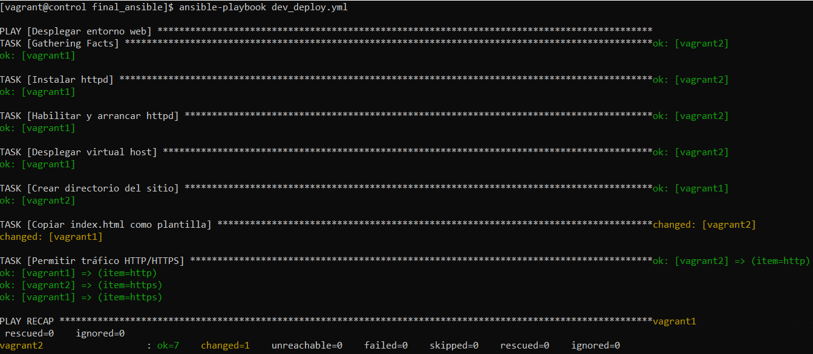
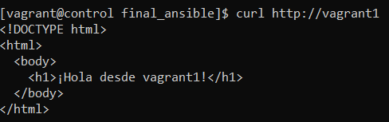

# Proyecto Final de Ansible – Automatización de Infraestructura

Este proyecto fue desarrollado como parte de una práctica final para demostrar el dominio de Ansible en la automatización de entornos y configuración de sistemas. Utiliza máquinas Vagrant y gestiona servidores remotos a través de playbooks organizados, reutilizables y bien documentados.

## Requisitos

- Ansible
- Vagrant
- VirtualBox
- Git

## Infraestructura

La infraestructura consta de 3 máquinas virtuales:

- `control` → nodo de administración que ejecuta Ansible
- `vagrant1` y `vagrant2` → nodos gestionados (grupo `servidores`)

## Estructura del proyecto

```
final_ansible/
├── ansible.cfg              # Configuración de Ansible
├── inventory                # Inventario con grupo 'servidores'
├── users.yml                # Creación de usuarios y lógica condicional
├── verify_user.yml          # Verificación sin modificación
├── dev_deploy.yml           # Despliegue de Apache, vhost y contenido
├── get_web_content.yml      # Test del servicio web con bloque rescue
├── site.yml                 # Playbook maestro que orquesta todo
├── templates/
│   ├── vhost.conf.j2        # Plantilla del virtual host de Apache
│   └── index.html.j2        # Plantilla dinámica con el nombre del host
├── img/
│   ├── dev_deploy.png       # Captura de la ejecución del playbook
│   └── curl_vagrant1.png    # Captura de validación del contenido web
└── .gitignore               # Evita subir claves, logs y archivos sensibles
```

## Playbooks 

### `users.yml`
- Crea los usuarios `carlos` y `marta`
- Instala `redis` solo si el host tiene más de 20 MB de swap
- Usa una variable `packages` como ejemplo de listas

### `verify_user.yml`
- Verifica si el usuario `carlos` existe
- No lo crea ni lo modifica
- Escribe un log si existe (modo seguro con `--check`)

### `dev_deploy.yml`
- Instala y arranca Apache (`httpd`)
- Despliega un virtual host dinámico con plantilla Jinja2
- Copia un `index.html` personalizado por hostname
- Configura el firewall para permitir tráfico HTTP y HTTPS
- Usa handlers para reiniciar `httpd` cuando sea necesario

### `get_web_content.yml`
- Lanza una petición a `http://vagrant1` desde `localhost`
- Si falla, guarda el contenido en `error.log` mediante un bloque `rescue`

### `site.yml`
- Orquesta `dev_deploy.yml` y `get_web_content.yml` para desplegar y verificar

## Ejecución

Desde la máquina `control`, navega a `~/final_ansible/` y ejecuta:

bash
ansible-playbook site.yml



Verifica que el servicio funcione:
curl http://vagrant1



Debe mostrar:
<h1>¡Hola desde vagrant1!</h1>

## Buenas prácticas

- Uso de handlers, templates y vars
- Separación de lógica en múltiples playbooks
- Control de errores con bloques rescue
- Seguridad: claves privadas excluidas con .gitignore
- Estructura de proyecto clara y mantenible

## Autora

Julia G. – Práctica final Ansible · Mayo 2025
github.com/ju-gavi

## Licencia

Proyecto de evaluación académica. No se distribuye en producción.


